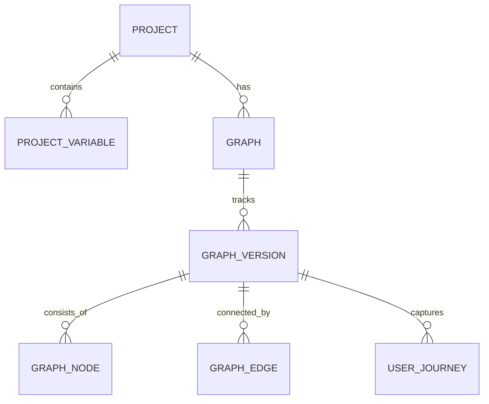

# 🧱 Architecture & Technical Deep Dive

Cognito is engineered for high performance and modularity, using a modern Next.js architecture that balances server-side stability with client-side interactivity.

## 🏗️ High-Level System Design

Cognito follows a **Unified Graph State** model. The entire workflow—from node positions to AI personas—is treated as a single, versioned JSON object stored in PostgreSQL.

### 🔄 The Development Lifecycle
1. **Architecting (Canvas)**: Uses `XYFlow` to manipulate a local state that periodically syncs to the database via `syncWorkflow` Server Action.
2. **Context Resolution**: Before an agent speaks, the `resolveNodePrompt` function identifies `@variable` markers and replaces them with live project or session values.
3. **The AI Loop**:
   - **Step 1**: User input is sent to the current node.
   - **Step 2**: Gemini generates a response using the `INTERACTIVE_INSTRUCTION` system prompt (ensuring JSON output for buttons/UI).
   - **Step 3**: The `evaluateNextNode` agent analyzes the conversation history against outgoing edge logic to decide the next transition.

## 🗄️ Database Schema (Drizzle ORM)

We utilize a relational schema designed for version control and lead capture:

- **GraphVersions**: Ensures that changes to a live workflow don't break existing public links. Tracks **visitCount** to provide real-time engagement metrics.
- **UserJourneys**: Captures a full transcript, captured variables, and the final AI report for every visitor. Used alongside version visits to calculate **conversion rates**.

## 🤖 AI Integration Strategy

Cognito utilizes a "Multi-Prompting" strategy to separate concerns between different AI tasks:

> [!NOTE]
> All primary AI logic is centralized in `src/lib/actions/preview.ts` and static instructions are consolidated in `src/lib/prompts.ts`.

| Task | Prompt Type | Goal |
| :--- | :--- | :--- |
| **Interaction** | Interactive | Generates chat text + UI buttons in a single LLM pass. |
| **Evaluation** | Logic | Analyzes conversation completion and identifies the next node key. |
| **Summarization** | Synthesis | Generates structured reports from history and form data. |
| **Storage** | Asset Mgmt | Handles multi-part uploads to GCS for project branding. |

## 🎨 UI & Aesthetics

- **Framer Motion**: Orchestrates complex layouts and cross-node transitions.
- **Tailwind CSS 4.0**: Handles the "Glassmorphic" design language, using high-alpha backgrounds and backdrop filters.
- **Lucide React**: Provides a consistent, professional iconography throughout the dashboard and visitor preview.

---

### 🛡️ Security & Authentication
- **User Scope**: Every project, workflow, and variable is strictly scoped to a Clerk `userId`.
- **Public Access**: Public preview links use unique UUID tokens to fetch specific, read-only versions of workflows without exposing project ownership.

---

Next: Learn how to contribute to the project in the [Contribution Guide](contribution.md).
